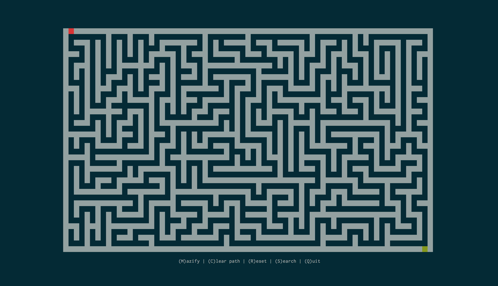

# Path Planning

A project created to experiment and visualise maze-generation and path-planning
algorithms all within the terminal using the `curses` module. Powered by Python.

## Getting Started

Within a terminal, simply `cd` into the primary directory and run `main.py` via
```
python3 main.py
```

## Usage

Pressing various keys leads to their respective actions:
* `S` – Seaches for a path towards the goal
* `M` – Creates a maze
* `R` – Resets board to its basic configuration
* `C` – Clears path and search visuals
* `Q` – Quits program 

## Built with

* [Curses](https://docs.python.org/3/howto/curses.html) – module used to control terminal displays

## Todos

* Add mouse usage (dragging nodes, adding walls, etc)
* Implement other searches (BFS, DFS, Greedy, Bidirectional, NBA*, etc)
* Prettier visualisation?

