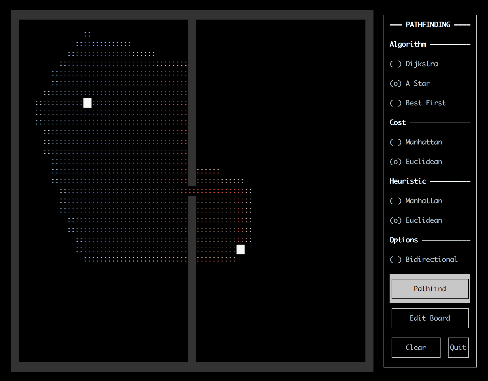

# Path Planning

A project created to experiment and visualise maze-generation and path-planning
algorithms all within the terminal using the `curses` module. Powered by Python.

## Getting Started

Within a terminal, simply `cd` into the primary directory and run `main.py` via
```
python3 main.py
```

## Built with

* [Curses](https://docs.python.org/3/howto/curses.html) – module used to control terminal displays

## Todos

* ~~Add mouse usage (dragging nodes, adding walls, etc)~~
  * Feature dropped – inconsistent support across various terminals
* Implement other searches (BFS, DFS, ~~Greedy~~, ~~Bidirectional~~, NBA*, etc)
* ~~Prettier visualisation~~ (Added 19/04/20)
* Better board-editing functionalities
* Various bug-fixes (inconsistent turn costs, screen flicker)

