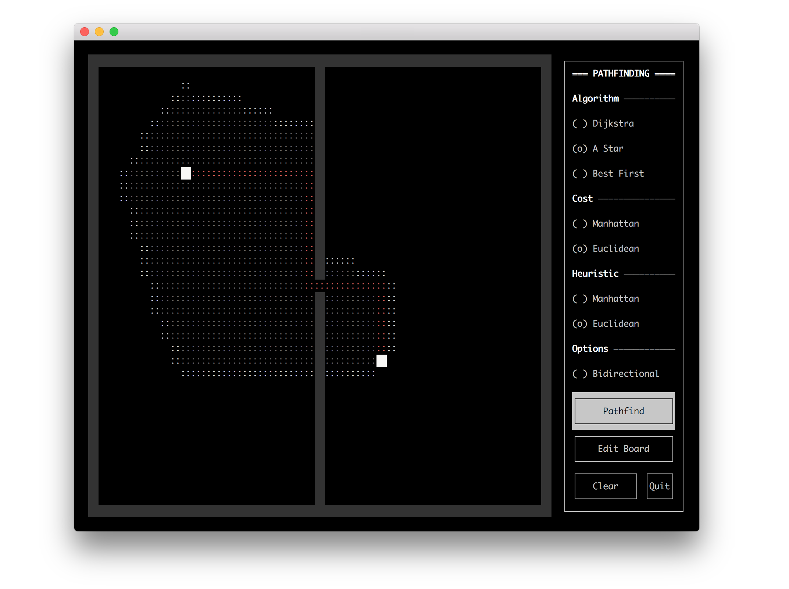

# Path Planning

## What is this?
A project created to experiment with maze-generation and path-planning
algorithms, whilst visualising results via the terminal using the `curses`
module. Powered by Python.

